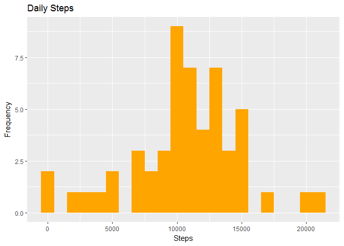
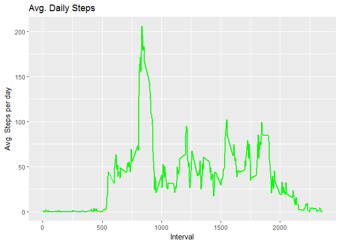
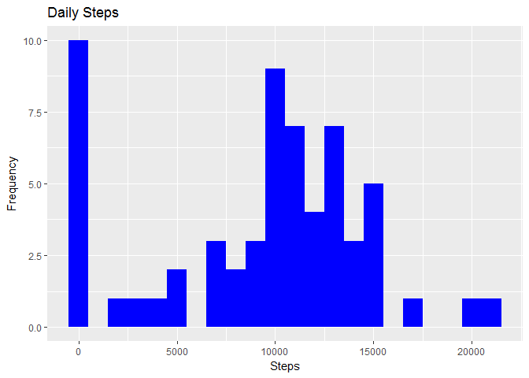
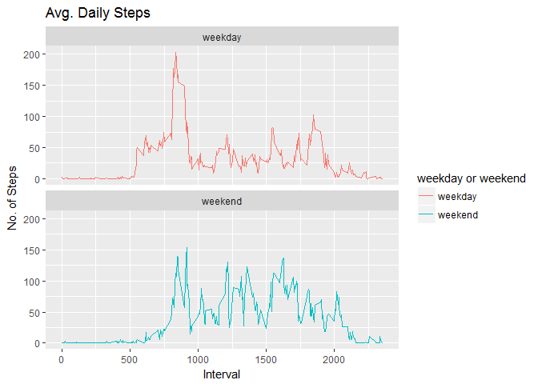

# Reproducible Research: Peer Assessment 1


## Loading and preprocessing the data

Code for reading in the dataset and/or processing the data:


```r
library(data.table)
library(ggplot2)

# Read in the data
ActivityData <- fread("activity.csv", header = TRUE)

# Calculate the total number of steps taken per day
StepsPerDay <- aggregate(ActivityData$steps, by=list(date=ActivityData$date), FUN=sum)
colnames(StepsPerDay) <- c("date", "steps")
StepsPerDay
```

```
##          date steps
## 1  2012-10-01    NA
## 2  2012-10-02   126
## 3  2012-10-03 11352
## 4  2012-10-04 12116
## 5  2012-10-05 13294
## 6  2012-10-06 15420
## 7  2012-10-07 11015
## 8  2012-10-08    NA
## 9  2012-10-09 12811
## 10 2012-10-10  9900
## 11 2012-10-11 10304
## 12 2012-10-12 17382
## 13 2012-10-13 12426
## 14 2012-10-14 15098
## 15 2012-10-15 10139
## 16 2012-10-16 15084
## 17 2012-10-17 13452
## 18 2012-10-18 10056
## 19 2012-10-19 11829
## 20 2012-10-20 10395
## 21 2012-10-21  8821
## 22 2012-10-22 13460
## 23 2012-10-23  8918
## 24 2012-10-24  8355
## 25 2012-10-25  2492
## 26 2012-10-26  6778
## 27 2012-10-27 10119
## 28 2012-10-28 11458
## 29 2012-10-29  5018
## 30 2012-10-30  9819
## 31 2012-10-31 15414
## 32 2012-11-01    NA
## 33 2012-11-02 10600
## 34 2012-11-03 10571
## 35 2012-11-04    NA
## 36 2012-11-05 10439
## 37 2012-11-06  8334
## 38 2012-11-07 12883
## 39 2012-11-08  3219
## 40 2012-11-09    NA
## 41 2012-11-10    NA
## 42 2012-11-11 12608
## 43 2012-11-12 10765
## 44 2012-11-13  7336
## 45 2012-11-14    NA
## 46 2012-11-15    41
## 47 2012-11-16  5441
## 48 2012-11-17 14339
## 49 2012-11-18 15110
## 50 2012-11-19  8841
## 51 2012-11-20  4472
## 52 2012-11-21 12787
## 53 2012-11-22 20427
## 54 2012-11-23 21194
## 55 2012-11-24 14478
## 56 2012-11-25 11834
## 57 2012-11-26 11162
## 58 2012-11-27 13646
## 59 2012-11-28 10183
## 60 2012-11-29  7047
## 61 2012-11-30    NA
```

Histogram of the total number of steps taken each day


```r
# Histogram of the total number of steps taken each day
Plot1 <-ggplot(StepsPerDay, aes(x = steps)) +
        geom_histogram(fill = "orange", binwidth = 1000) +
        labs(title = "Daily Steps", x = "Steps", y = "Frequency")

plot(Plot1)
```

<!-- -->

## What is mean total number of steps taken per day?

The Mean and Median total number of steps taken per day is below:


```r
# Calculate and report the mean and median of the total number of steps taken per day
MeanSteps = mean(StepsPerDay$steps, na.rm = TRUE)
MedianSteps = median(StepsPerDay$steps, na.rm = TRUE)
MeanSteps
```

```
## [1] 10766.19
```

```r
MedianSteps
```

```
## [1] 10765
```


## What is the average daily activity pattern?

Time series plot of the average number of steps taken:


```r
# Make a time series plot (i.e. type = "l") of the 5-minute interval (x-axis) and the average number of steps taken, averaged across all days (y-axis)
Interval <- ActivityData[, c(lapply(.SD, mean, na.rm = TRUE)), .SDcols = c("steps"), by = .(interval)] 
Plot2 <-ggplot(Interval, aes(x = interval , y = steps)) + geom_line(color="green", size=1) + labs(title = "Avg. Daily Steps", x = "Interval", y = "Avg. Steps per day")

plot(Plot2)
```

<!-- -->

The 5-minute interval that, on average, contains the maximum number of steps is below


```r
# Which 5-minute interval, on average across all the days in the dataset, contains the maximum number of steps?
Interval[steps == max(steps), .(max_interval = interval)]
```

```
##    max_interval
## 1:          835
```

The total number of missing values in the dataset is below


```r
# Calculate and report the total number of missing values in the dataset (i.e. the total number of rows with NA\color{red}{\verb|NA|}NAs)
sum(is.na(ActivityData$steps))
```

```
## [1] 2304
```


## Imputing missing values

Code to describe and show a strategy for imputing missing data:


```r
# Devise a strategy for filling in all of the missing values in the dataset: fill in using median
ActivityDataNonNA <- ActivityData
ActivityDataNonNA[is.na(steps), "steps"] <- ActivityDataNonNA[, c(lapply(.SD, median, na.rm = TRUE)), .SDcols = c("steps")]

# Create a new dataset that is equal to the original dataset but with the missing data filled in.
write.table(file,"activity_non_na.csv", row.names=FALSE,col.names=TRUE,sep=",")
```

Histogram of the total number of steps taken each day after missing values are imputed


```r
# Histogram of the total number of steps taken each day - NEW
StepsPerDayNonNA <- aggregate(ActivityDataNonNA$steps, by=list(date=ActivityDataNonNA$date), FUN=sum)
colnames(StepsPerDayNonNA) <- c("date", "steps")

Plot3 <- ggplot(StepsPerDayNonNA, aes(x = steps)) +
        geom_histogram(fill = "blue", binwidth = 1000) +
        labs(title = "Daily Steps", x = "Steps", y = "Frequency")
        
plot(Plot3)
```

<!-- -->

Mean and median of the total number of steps taken per day


```r
# Calculate and report the mean and median of the total number of steps taken per day - NEW
MeanStepsNonNA = mean(StepsPerDayNonNA$steps, na.rm = TRUE)
MedianStepsNonNA = median(StepsPerDayNonNA$steps, na.rm = TRUE)
```

## Are there differences in activity patterns between weekdays and weekends?


There is a difference in activity patterns between weekdays and weekends. On weekdays, the number of steps is higher and the interval is shorter. On Weekends, the number of steps is lower and the interval is longer.


```r
# Create a new factor variable in the dataset with two levels - "weekday" and "weekend" indicating whether a given date is a weekday or weekend day.
ActivityDataNonNA[, date := as.POSIXct(date, format = "%Y-%m-%d")]
ActivityDataNonNA[, `Day of Week`:= weekdays(x = date)]

ActivityDataNonNA[grepl(pattern = "Monday|Tuesday|Wednesday|Thursday|Friday", x = `Day of Week`), "weekday or weekend"] <- "weekday"
ActivityDataNonNA[grepl(pattern = "Saturday|Sunday", x = `Day of Week`), "weekday or weekend"] <- "weekend"

ActivityDataNonNA$`weekday or weekend` <- as.factor(ActivityDataNonNA$`weekday or weekend`)   
```

Panel plot comparing the average number of steps taken per 5-minute interval across weekdays and weekends


```r
# Make a panel plot containing a time series plot (i.e. type = "l") of the 5-minute interval (x-axis) and the average number of steps taken, averaged across all weekday days or weekend days (y-axis)
ActivityDataNonNA[is.na(steps), "steps"] <- ActivityDataNonNA[, c(lapply(.SD, median, na.rm = TRUE)), .SDcols = c("steps")]
Interval_new <- ActivityDataNonNA[, c(lapply(.SD, mean, na.rm = TRUE)), .SDcols = c("steps"), by = .(interval, `weekday or weekend`)] 

Plot4 <- ggplot(Interval_new , aes(x = interval , y = steps, color=`weekday or weekend`)) + geom_line() + labs(title = "Avg. Daily Steps", x = "Interval", y = "No. of Steps") + facet_wrap(~`weekday or weekend` , ncol = 1, nrow=2)
plot(Plot4)
```

<!-- -->
